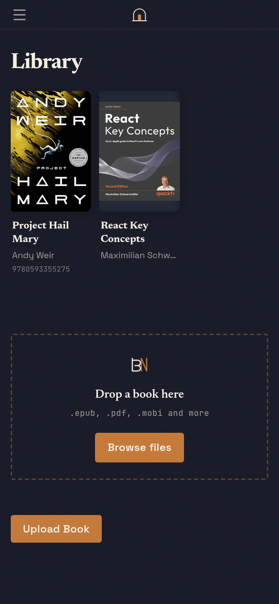
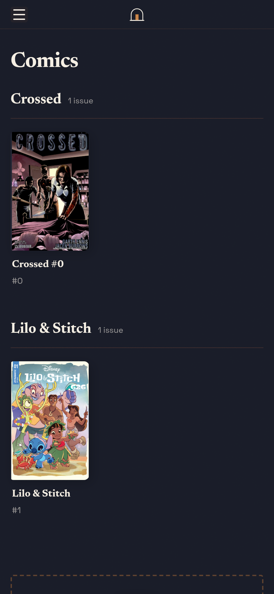
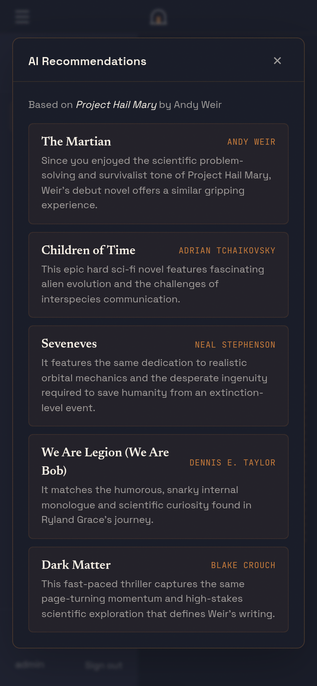
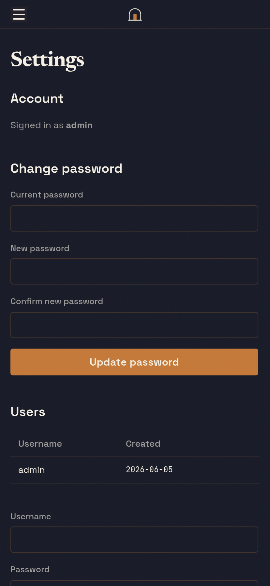
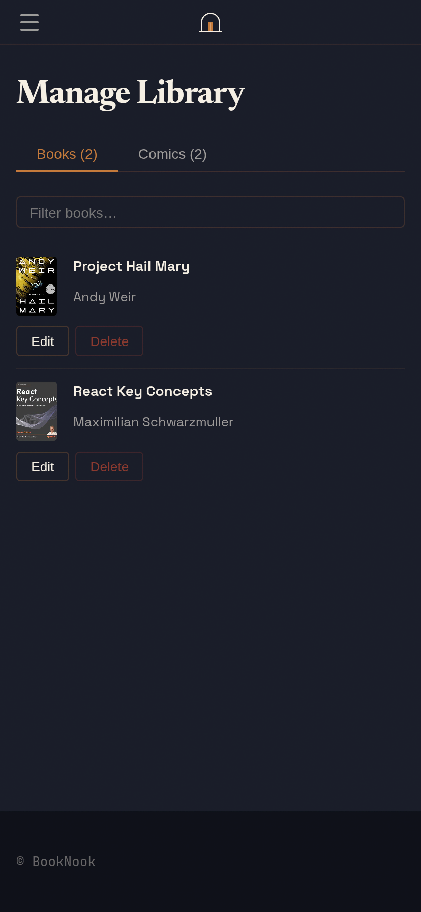

# Booknook

A self-hosted personal library server for ebooks and comics. Runs on [Bun](https://bun.sh) with Hono, SQLite via Sequelize, and a plugin system for extending functionality.

**[Documentation →](https://zadenmaestas.github.io/booknook-app/)**

## Screenshots

| Library | Comics |
|---|---|
|  |  |

| AI Integration | Settings |
|---|---|
|  |  |



## Features

- **Ebooks** — upload and read EPUB/PDF files with a full in-browser reader powered by [foliate-js](https://github.com/johnfactotum/foliate-js)
- **Comics** — upload CBZ/CBR files; series are auto-detected and shown as browsable series pages with stacked cover art
- **Auto-status** — opening a book or comic sets it to *reading*; finishing sets it to *read* automatically
- **Multi-user** — session-based auth with per-user reading progress; admin panel for user management
- **Plugin system** — drop a folder into `plugins/` to add new routes, nav items, and lifecycle hooks
- **Docker-ready** — single `docker compose up` for production deployment

## Quick start

```bash
docker compose up -d
```

Or for local development:

```bash
bun install
cp .env.example .env   # edit as needed
bun run dev
```

See the [Getting Started guide](https://zadenmaestas.github.io/booknook-app/getting-started/) for full setup instructions.

## Environment variables

| Variable | Required | Description |
|---|---|---|
| `SESSION_SECRET` | **yes** | Secret for signing session cookies (`openssl rand -hex 32`) |
| `ADMIN_USERNAME` | no | Username for the auto-created admin account |
| `ADMIN_PASSWORD` | no | Password for the auto-created admin account |
| `GOOGLE_BOOKS_API_KEY` | no | Improves book metadata and cover quality |
| `GEMINI_API_KEY` | no | Enables the AI recommendations plugin |
| `DATA_DIR` | no | Custom path for the SQLite database (useful in Docker) |

## Plugins

Bundled plugins:

| Plugin | Description |
|---|---|
| [ai-integration](plugins/ai-integration/) | AI-powered book recommendations via Google Gemini |

See the [Plugin System docs](https://zadenmaestas.github.io/booknook-app/plugins/writing-plugins/) to write your own.

## Scripts

```bash
bun run dev          # dev mode with auto-restart
bun run start        # production start
bun run typecheck    # tsc --noEmit
```
